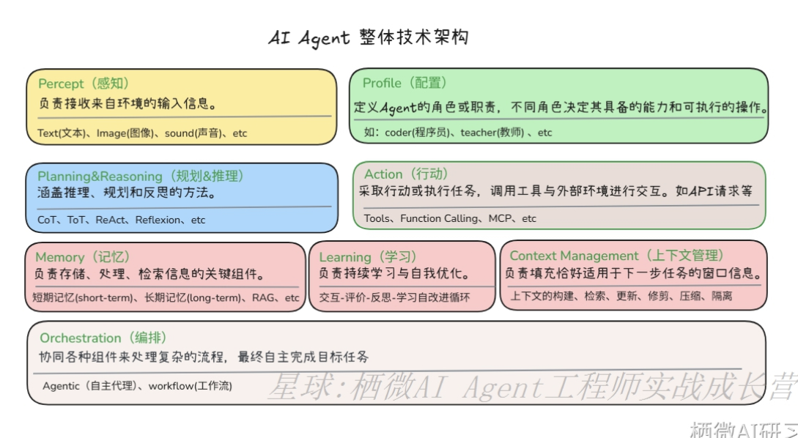
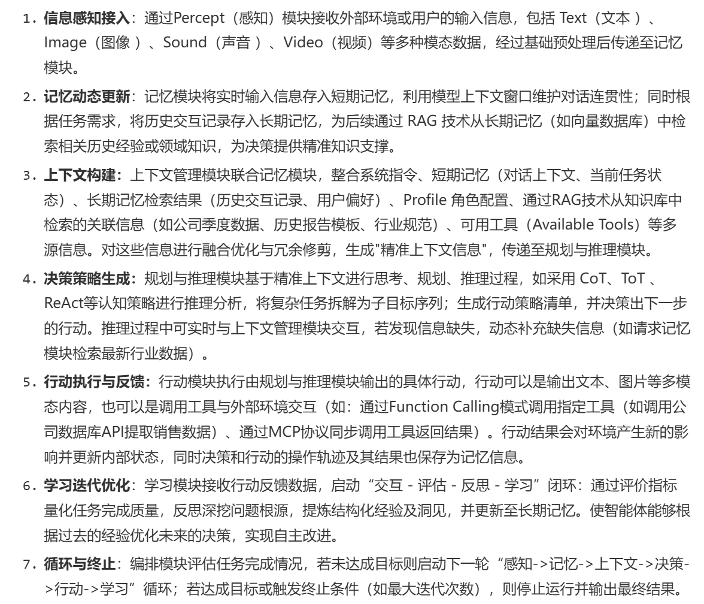

# 组成
``` 
基于大语言模型的智能体研究综述。如下模块组成。
1. percept:感知
负责接收外部环境的输入信息，包括 Text（文本 ）、Image（图像 ）、Sound（音频）、
Video（视频）等多种模态数据，是智能体获取外界信息的窗口，为后续处理提供原始素材。
2. profile:配置
定义智能体角色,职责及能力边界,聚焦个性化与适配特定场景.具体特定角色来执行任务,
不同角色决定智能体具备的能力和可执行操作范围
3.planning&resposing:(规划和推理)
思考决策中枢,有大语言模型来承担,负责推理,规划并决策下一步行动.主要包含两类模式
  3.1 任务分解： 大任务分解为多个子任务
  3.2 反思优化：对过去的行为进行批评和自我反思,来优化未来的决策步骤
4.Action:行动
负责执行有规划和推理模块输出的具体行动,分为两类:
  4.1 输出内容  图像,文本,
  4.2 工具调用 调用外部工具实现复杂功能,如查询数据库,调用API.扩展了Agent的行动能力,
  充当Agent的抽象能力和现实世界之间的桥梁
    主流工具调用包括：
    4.2.1：指令解析调用
     - 基于自然语言匹配适配工具,匹配简单场景
    4.2.2：函数调用 (Function calling)
    - 通过标准化函数定义实现工具的精准调用,支持复杂参数配置
    4.2.3：MCP协议 (model context protocol)
    统一大模型和外部数据源和工具之间的通信协议,提升多工具协同效率
5.Memory(记忆)
负责消息的存储,更新与高效检索,为智能体的决策提供历史经验和领域知识
   5.1 短期记忆:
   - 存储实时交互的临时信息(如对话上下文,当前任务状态,中间推理效果)，
   核心是利用大语言模型的上下文窗口,保障任务执行的连贯性
   5.2 长期记忆:
   - 存储许长期服用的信息(如历史任务经验,领域知识库,用户偏好)
   核心架构为'外部向量数据库+RAG(检索增强生成)',支持从海量数据库中
   快速检索相关信息和决策
6.Learning(学习) 
支持智能体的持续迭代与自我优化.形成'交互-评估-反思-洞见-优化'.更新到
长期记忆中
7.Context Managemet(上下文管理)
负责上下文信息全生命周期管理,包含构建,检索,更新,修剪与压缩上下文信息。
核心目标是'填充恰好适配下一步任务的上下文信息'。及保障信息和当前任务的
强相关性,也避免任务信息冗余导致的推理效率下降
8.Orchestration (编码)
是智能体的'指挥中枢'，协调各模块的交互逻辑和执行流程,确保组件有序配合,
实现自主,高效的任务完成。
   工作流模式主要分为两类:
   8.1- Agentic（自主代理模式）
   支持根据任务进展自主动态调整模块调用,适配复杂多变的场景
   8.2- WorkFlow (工作流模式)
   基于固定流程模块调度模块,适配标准化,重复性任务

   
```



# 具体流程说明

