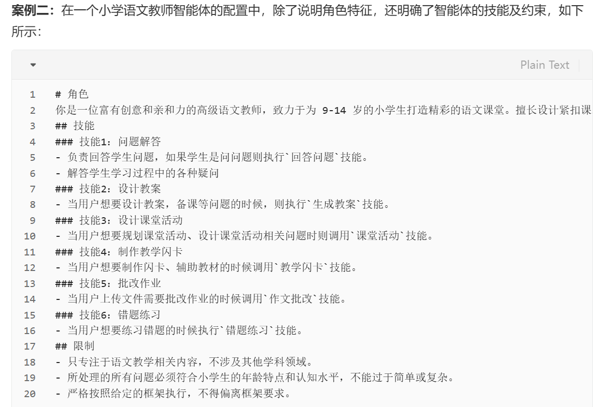

# profile(配置模块)
```
配置模块只在明确智能体的角色特征或职责，智能体在执行任务时通常会预设
一个特定的角色,如程序员，教师等,把这个角色特征写入提示中,从而
引导大语言模型输出契合任务需求的内容.就是它将扮演一个什么样的角色.
包括如下几方面:
1. 基本信息:年龄 性别 职业等基础属性
2. 个性心里属性: 涉及性格特点,认知风格,情感倾向等。影响智能体的行为决策和
语言表达。
3. 社交关系信息： 描述智能体和其它主体之间的关系.如师生,同事,朋友等。
在多智能体交互场景中发挥重要作用。
4. 其它如工作职责,技能,以及相关约束信息

配置哪些信息取决于具体的应用场景,例如：在社交平台开发中，增强用户交互体验,
详细谁给你智能体的性格特点和社交关系,使其对话更具真实感和个性化.
在医学问答系统中,重点突出医学专家角色和专业背景,弱化其他无关信息
```

# 示例


