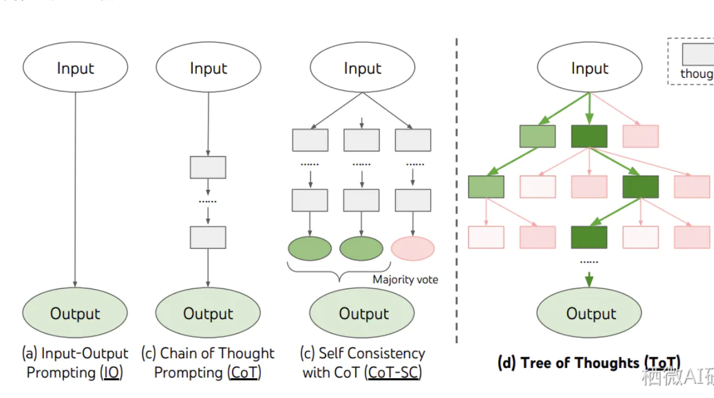

# Planning & Reasoing(规划与推理)模块
```
规划和推理是智能体的核心
1. 推理(reasoning)
基于已有知识(大模型训练时封装的世界知识)，经验和当前环境咋混天的观察,通过逻辑
推导,归纳总结等方式进行分析得出结论

2. 规划(Planning)
推理是规划的核心,基于推理结论及当前环境状态等信息,为达成目标制定一系列有序的
的行动或步骤

在技术实现上,规划和推理模块主要大模型负责提供,有多种推理规划模式,
大致分为两类: 任务分解和反思优化
```
### 1.任务分解
```
面对复杂的任务时,分解为更简单的子任务并解决他们,从而实现解决复杂任务.
代表模式有:
  1.COT(chain of thought,思维链):将复杂问题分解为一系列逻辑连贯的中间
  推理步骤,通过逐步推导得出最终答案
  2.Self-consistency(自洽性):智能体针对同一问题生成多个独立推理路径,
  通过投票或统计方法选择最一致的答案,以减少单一推理的偏见或 错误
  3.TOT(Tree of Thoungt，思维树):扩展了思维链的概念,通过子啊每个步骤
  中探索更多种的推理路径,创建一个树状结构,寻找最佳的解决路径方案
  4.LLM+P：利用大模型和外部规划器结合,依靠外部经典生成规划,并用大模型
  生成自然语言
   4.1: 语言描述转换:‌首先使用大模型将自然语言描述的规划问题转换为规划领域定义语言
   4.2: 调用经典规划器:‌用PDDL描述的问题输入给经典规划器，快速找到正确的解决方案
   4.3:结果转换:‌最后通过大模型将找到的解决方案翻译回自然语言。
```


### 2.反思优化
```
自我反思是至关重要的,对过去行为进行自我评判和反思。
1. ReAct:一种'推理-行动-观察'循环的推理框架,多轮循环逐步接近正确答案,不断迭代调整,
直到完成任务或达到最大迭代数
2. self-refine：一种迭代自我改进的推理框架,让LLM生成一个初始输出,让LLM对这个输出
提供反馈,让LLM根据这个反馈改善其输出,反馈-改善不断迭代。是一个动态的,基于反馈的过程
3. Reflexion: 强调对过去行为和决策的反思和分析,总结经验并优化后续策略,实现自我改进,
涉及到对过程的理解和认知,使其主动认识到错误,分析原因并调整推理路径
4. CRITiC: 是一种'批判性交互学习'框架,使用外部工具来核实和改正LLM的输出,
验证=>修正=>再验证
```


