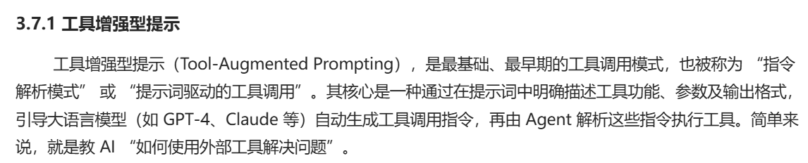
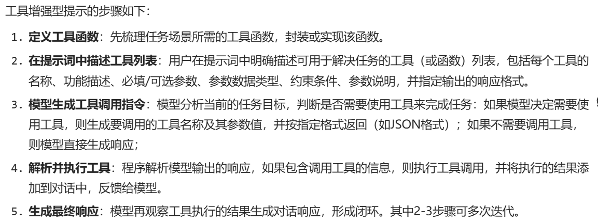
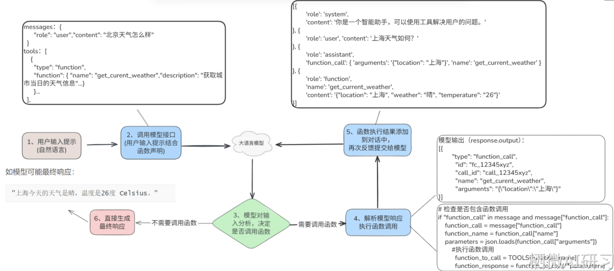
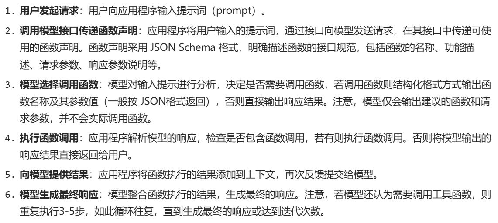
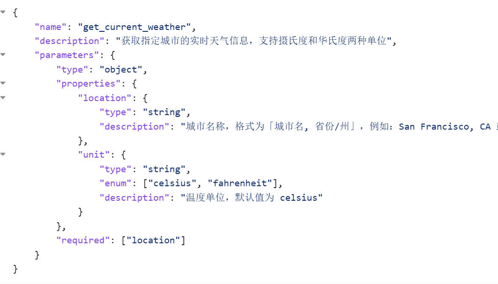
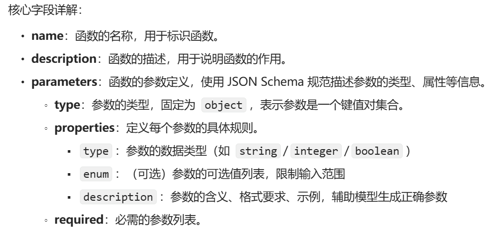
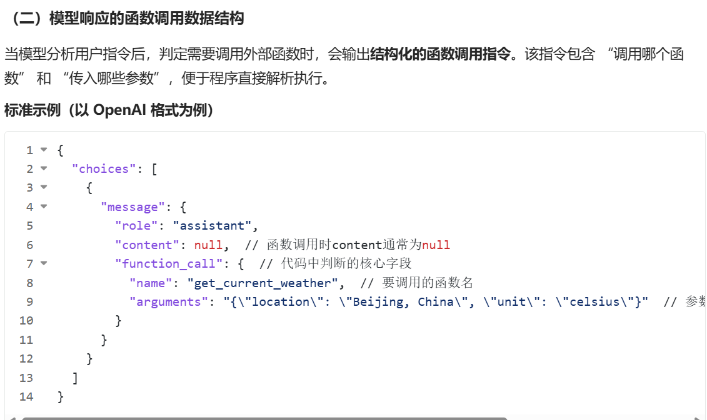
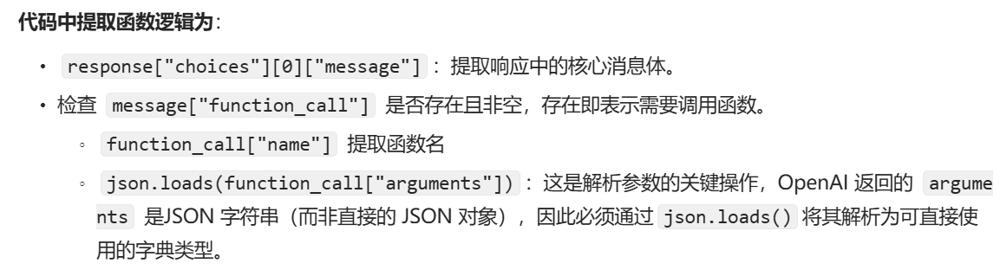

# Action(行动)模块 
```
一共分为三种:
1. 工具增强型提示
是一种通过在提示词职工直接描述工具,参数,及输出格式.引导大语言模型生成
规范的工具(函数)调用指令(如按JSON格式输出需要调用的函数名称及其参数).
此方法简单但依赖精细的提升工程及大模型的遵循能力
2. Funciton Calling（函数调用）
让开发者自定义函数(工具tools),通过接口请求模型时,附带上定义的函数模式,
大模型会智能的选择需要的调用函数,并以格式化输出调用的函数名称及其参数
(一般用JSOn格式).
3. MCP协议(Model Context Protocol)
是一种定义模型与工具的上下文协议,旨在解决不同大语言模型和不同外部工具
集成标准化问题。好处能够以一种统一的方式将各种数据源和工具链接AI大模型,
从而提升大模型的实用性和灵活性
```

## 1.工具增强型提示




##  2.Function Calling
```
是一种大语言模型和外部工具交互的机制,让大语言模型将自然语言解析为结构化
的工具并调用请求,实现和第三方系统对接的能力.能获取最新的数据,如航班,新闻状态,
和外部系统交互。提高了输出稳定性,简化了工具增强提示工程的复杂度.大模型智能的
选择调用那个函数来解决问题,并输出.
注意:并不是所有的大模型都支持Function calling.支持的模型(gpt4,qwen-plus等)
能检测出何时调用函数,并输出调用函数名称的,参数及其值的JSON格式化数据
```

### 2.1 Function Calling两个主要场景应用
```
  1. 获取数据: 通过检索最新,特定的外部信息(如实时天气数据,知识库内容,
  API返回的业务数据等).解决了模型自身知识滞后或缺乏特定领域数据的问题,
  让响应更准,贴合实际。
  2. 执行操作: 触发并执行各类具体操作,包括提交表单,调用业务API,修改应用
  状态(如UI交互状态,后端数据状态),操作机器,以及执行代理工作流操作(如
  对话移交,多步骤任务调度等).该场景实现了模型从'仅生成文本'到'实际干预
  外部环境行为'的跨越
```
### 2.2 Function Calling工作流程




### 2.3 Function Calling核心数据结构

#### 2.3.1 Function Calling函数定义的函数结构
```
通过JSON Schema 明确函数的名称,功能描述,参数规则,让模型理解'能调用什么,
需要传什么参数'.
```




#### 2.3.2 Function Calling模型响应的函数调用数据结构





