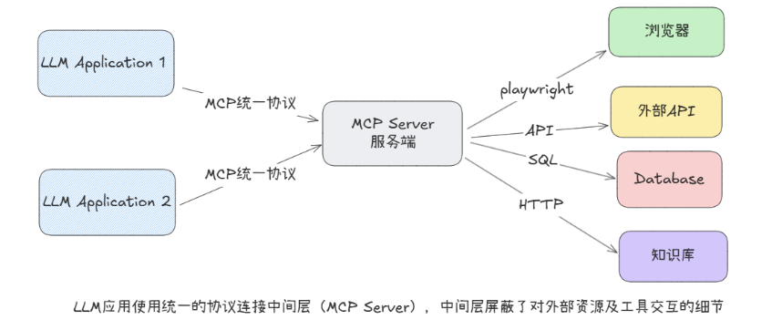
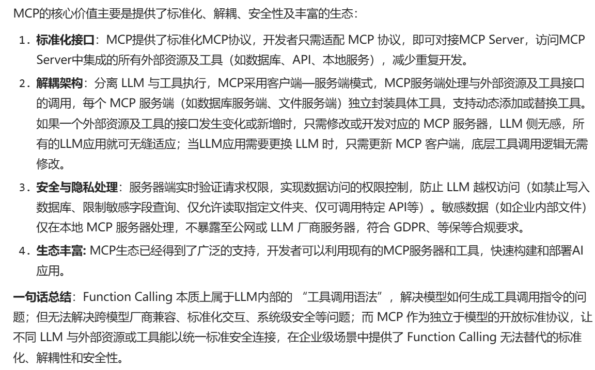
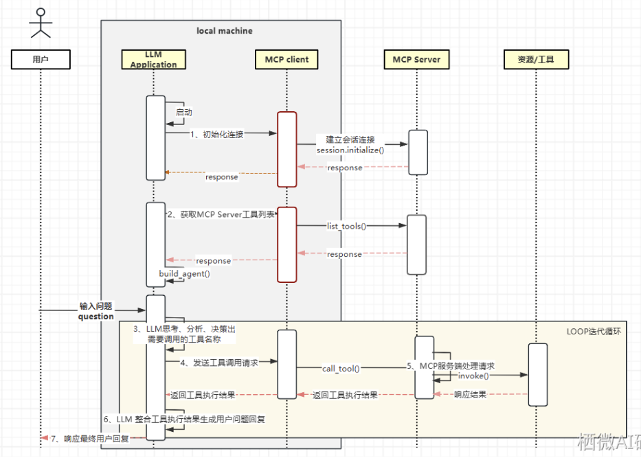
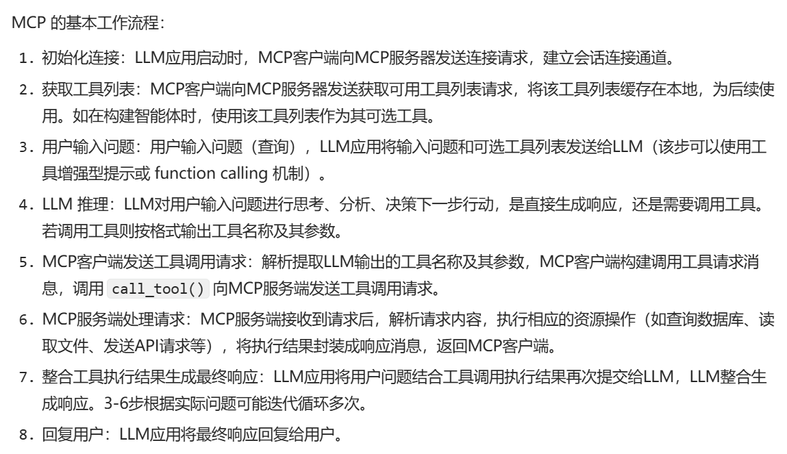

# Action(行动)模块 - MCP

## 介绍:
```
MCP:(Model Context Protocol)：旨在标准化外部工具和数据源之间的通信协议。
```

## 为什么需要MCP
```
1. 外部工具对接成本高:LLM需要频繁访问本地文件,数据库,API等外部资源.
但各系统接口标准不一(如SQL.websocket).开发者需要单独开发，适配差
2.绑定模型供应商:不同LLM厂商的工具调用协议互不兼容,当应用需要变更
模型服务商时需要重写集成逻辑.如参数逻辑和返回逻辑不对导致全部失效
3.数据安全和隐私分险:传统方式中,LLM应用可能直接访问敏感数据(如企业
内部文档)。缺乏统一的权限控制和数据脱敏机制.存在泄露分险
```
## 在LLM和外部资源之间增加一个中间层
```
MCP就是帮助简化LLM应用与外部资源之间集成的中间层,允许LLM应用使用统一
的协议来连接到外部资源及工具,而不必逐个适配
```


## 优点


## 工作流程




