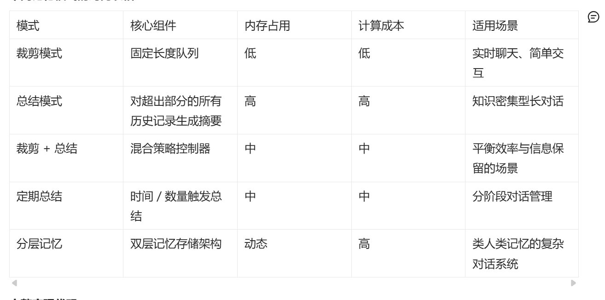
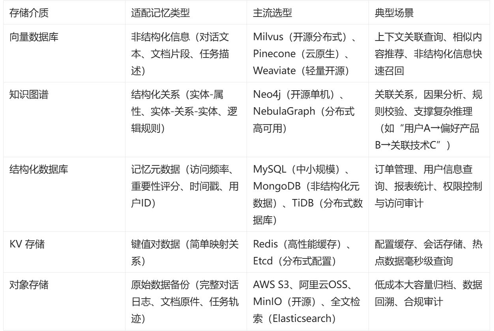
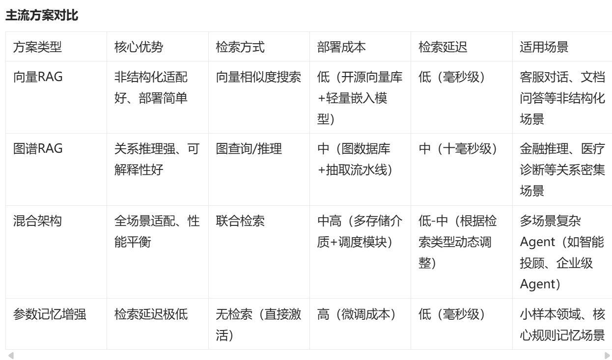
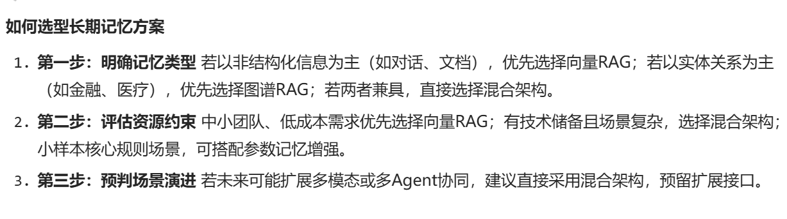

# Memory(记忆模块)

## 记忆的类型
```
1. 短期记忆
2. 长期记忆
```

### 短期记忆
```
1. 裁剪记忆模式(Trim)
超过设置长度就把以前多的裁掉 使用简单问答,对话独立
2. 总结记忆模式(Summarize) ：超过长度时,把对话内容提炼成简短关键信息 
适合长对场景,如论文讨论,项目方案沟通
3. 裁剪+总结记忆模式(Trim + Summarize):
对话数量达到一定程度,超出部分总结,裁剪，
保留总结内容+记忆长度数量的对话
使用与小说创作,讨论需要回顾之前的情节设定,又要控制输入内容长度
4. 定期总结记忆模式(Regularly Summarize)
按照设定的间隔,对对话进行总结.
每达到一定数量的新消息,系就会对这段时间的对话生成总结,替代旧对话记录
5. 裁剪+总结记忆模式(Trim + Summarize) 
将对话分为短期和长期记忆,短期保留最近的消息,超出一定阀值,旧消息一道长期记忆,
长期记忆达到时,会对其总结并删除最早的阀值消息. 
适用同时处理近期和历史信息的复杂对话场景,
如学术研究,近期交流,过往研究成果都需要参考
```



### 长期记忆
```
实现AI Agent长期记忆的核心挑战,归结为三大问题
1. 海量异构信息的持久化存储(如何存)
2. 高效精准的信息检索(如何找)
3. 记忆内容的动态更新和优化(如何更新)

外部记忆机制
1. 向量RAG方案(基于向量检索的增强生成) 适用用户历史对话记录,实现上下文连贯的对话体验
2. 图谱RAG方案(基于知识图谱的增强生成)  实体-关系-实体关系,适合金融,医疗等复杂关系推理领域
3. 混合架构方案(向量+ 图谱 + 其它存储形式的融合) 更灵活准确
在加一个模型调整
4. 参数记忆增强:信息通过微调注入模型参数中,推理时无需检索,直接激活,即参数记忆增强方案
```


## 选型




