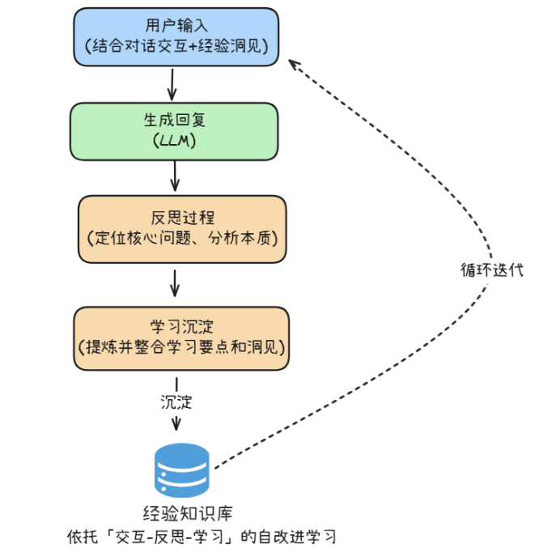
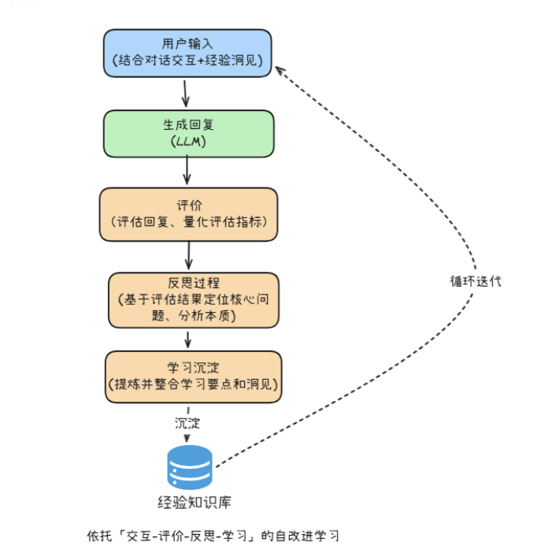

# Learning(学习模块)

## 五大核心学习模式
```
1. 预训练(Pretraining):
用海量数据学习通用知识，基础技能,与领域规律。
搭建初始能力底座,奠定夸任务适配的基础
2. 强化学习(RL):
通过'试错-反馈(奖励/惩罚)'的闭环,在交互过程中,根据用户反馈持续优化
行动策略,强化有效行为,实现策略的自使用迭代
3. 参数微调(Parameter Tuning)
当Agent需要掌握全新知识领域知识,(如[旅游咨询]到[医疗咨询]),通过
[领域高质量数据微调]更新参数模型,让它从底层具备新领域的认知能力,
实现领域能力的深度迁移
4. 零样本/少样本学习(Zero-shot/few-shot Leaning)
在仅提供少量示例或无示例的场景下,将'任务说明+3-5条典型示例'直接
嵌入提示词,依托大模型自带的类比推理与模式识别能力,快速理解新任务
和核心要求和处理逻辑,让Agent输出符合新格式或新领域的结果,提升
任务适配灵活性
5. 基于对话历史/交互数据的自改进学习(self-improving Learning)
从和用户的实时互动,任务执行反馈中提取关键问题与优化点,通过'反思-学习-优化'
的闭环,提取经验和教训.动态更新自身知识储备与行为模式,无需训练模型,
低开销的实现个性化需求适配和能力的持续迭代,从'被动学习''走向
''主动优化'的核心支撑

分为两类:前三种通过训练直接更新底座模型参数,实现能力的根本性学习,
后两种用大模型的上下文学习来实现,无需改动模型底层参数,通过提示工程,
交互经验提炼等轻量化方式,即可快速响应新任务需求,动态适配场景变化
```

## 自改进学习 自改进智能体
### 1. 交互-反思-学习

### 2. 交互-评价-反思-学习


