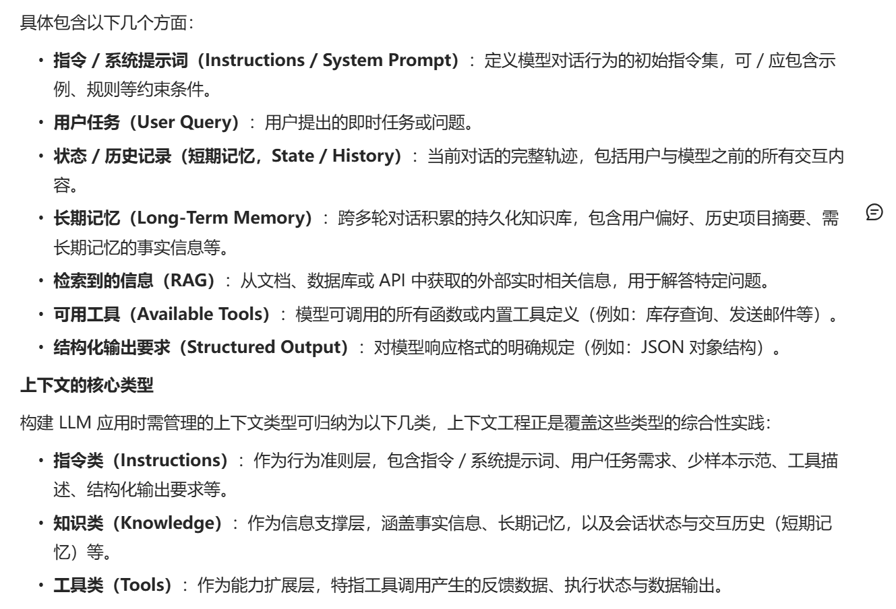
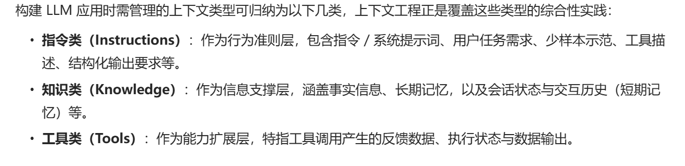
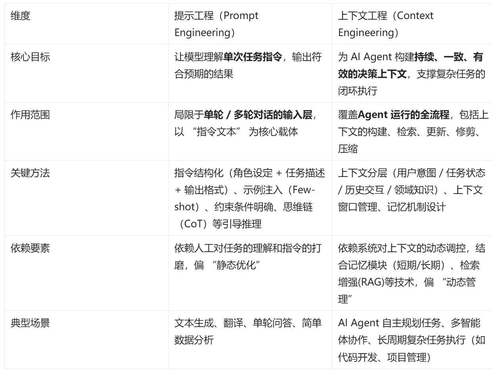
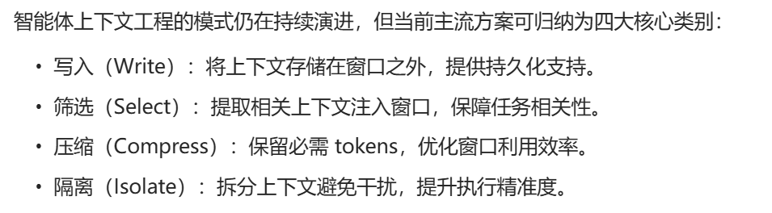

# 上下文管理(Context Management)模块

## 为什么会有
```
1. 上下文污染: 幻觉或其他错误信息混入上下文后,被反复引用
2. 上下文分心: 过长导致模型聚焦于上下文内容,忽视了阶段训练
学到的知识
3. 上下文混淆: 上下文存在多余的信息,模型据此生成低质量回答
4. 上下文冲突: 上下文累计的信息于提示中的其他信息产生矛盾
```

## 什么是
```
为任务提供所有必要的上下文,让大语言模型能合理的完成任务的艺术
```

## 核心




## 和提示工程的区别
```
本质区别:
1. 提示工程聚焦于"指令的精准设计".是面向单次交互输入优化
2.上下文工程聚焦于'上下文信息的全生命周期管理',面向智能体持续决策的生态系统的构建
```


## 主流实现范试
### 1.上下文写入(write context)
```
1. 草稿本(Scratchpads)
2. 记忆(Memorieies)
```
### 2.上下文筛选(select context)
```
1.从草稿本筛选
2.从记忆筛选
3.工具筛选 工具过多会导致信息过载 用检索增强生成(RAG)用于工具描述,基于语义进行筛选
4.知识筛选 
```

### 3.上下文压缩
```
1. 上下文总结(context sunmmarization)
2. 上下文裁剪(context trimming)
```

### 4.上下文隔离
```
1.多智能体架构
2.基于环境的上下文隔离
3.状态对象
```

### 总结

