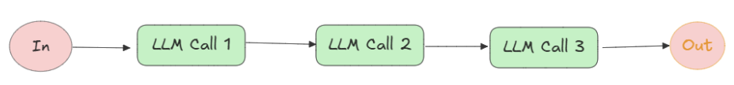
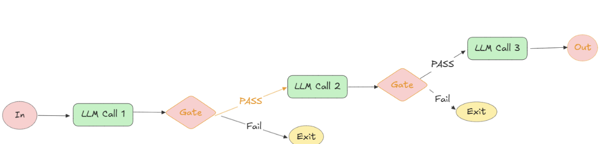
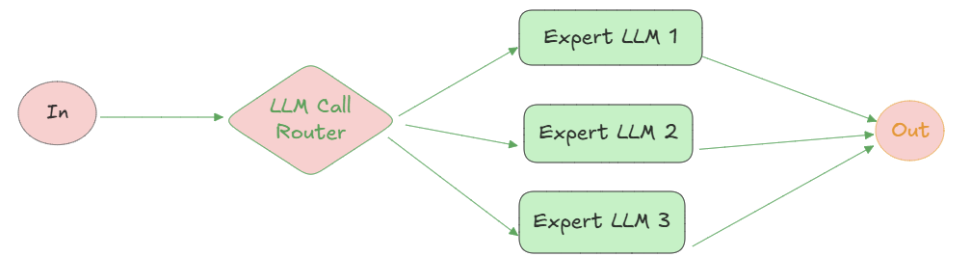
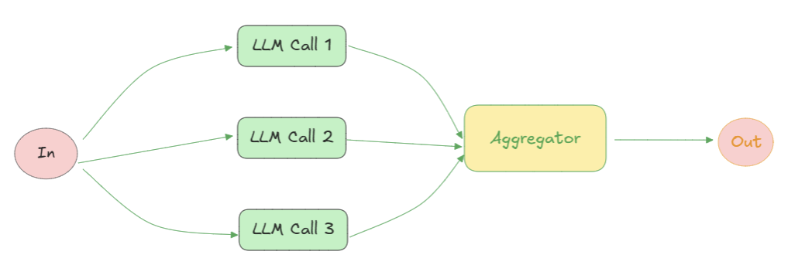
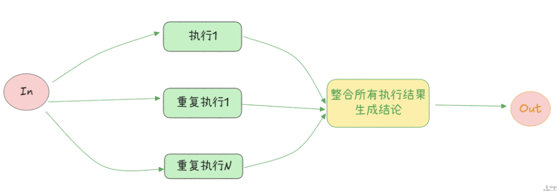
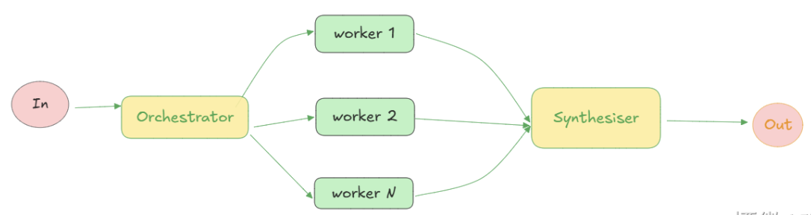
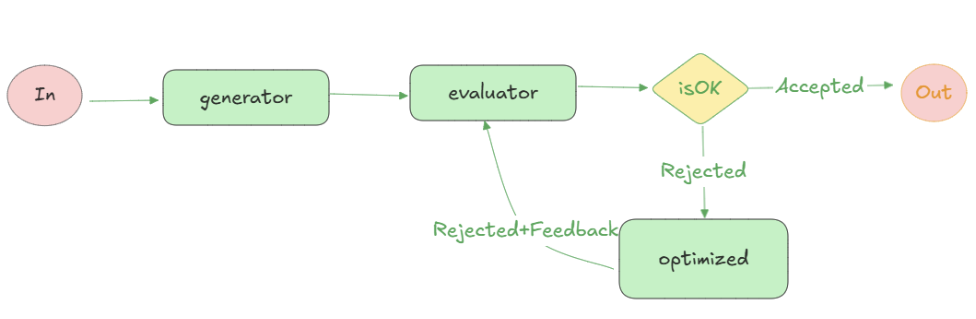
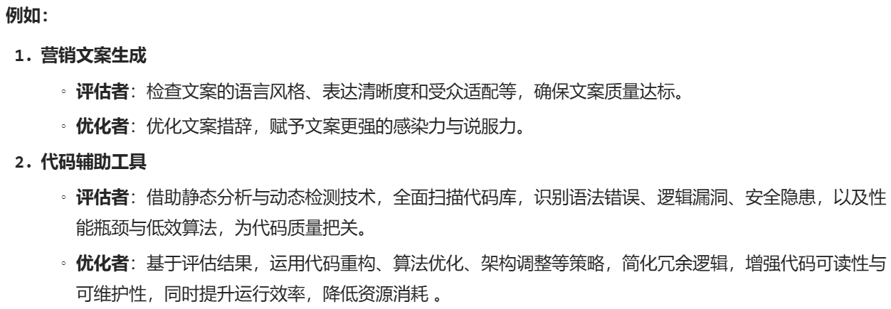
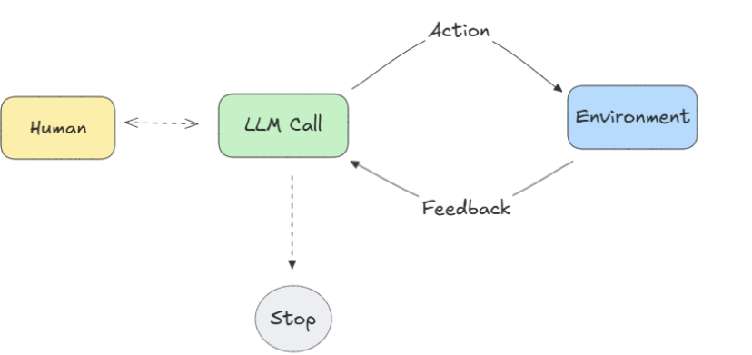
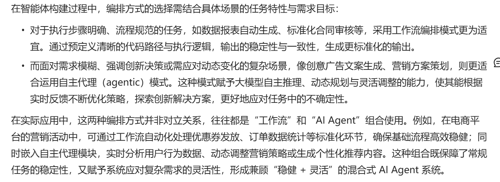

# Orchestration(编排模块)

```
分为两种工作方式
1.工作流(work flows)方式
2.自主代理(agentic)模式
```

## 一:工作流(workflows)方式
```
通过预编译编码路径来协调LLM和工具的使用,适用于固定任务流程的场景.
如下7种模式
```

### 1.1:提示链式调用(prompt chaining)

```
将复杂任务分解为一系列小步骤,每个LLM调用处理前一个LLM的输出,
将任务分为很多个小步骤,每个引导正确的方向前进,就像拼图一样,
一块块完成.适用场景,任务可以清晰的分解为固定的子任务时,流程非常理想.
```
### 1.2 门控机制(Gating)

```
在1.1中一个接一个的处理,如果有出错或偏差,导致问题越来越大.解决方法是
在中间步骤添加决策点或检查点,确报始终沿着正确的路径执行,这就是门控机制
```
### 1.3 路由(routing)

```
工作流的重要组成部分,能够根据用户输入的类型,内容或意图,将任务分配给
最合适的处理模块,进而在专业处理中构架更针对性的提示.此工作流将,接收
用户输入,分析用户意图并确定任务类型,将任务路由转到对应专业的Agent.
适用复杂任务,任务重存在明确的类别边界,更适合分别处理,并且分类可以
通过LLM或传统分类模型/算法实现精准分类判定
```
### 1.4 并行化(Parallelization)

```
通过多线程同时处理独立,并行运行的子任务单元,可以显著的提升AI Agent完成
任务及速率.能任务分离,并行执行。如一个LLM处理用户查询,一个LLM复杂内容审核。
```
### 1.5 投票机制

```
本质上是并行化策略的一种典型特例,其核心逻辑是重复执行同一个任务,从不同角度
获取多个答案(单次执行难覆盖所有可能性)，在整合多次执行结果生成响应,提升可信度。
适合:需要多维度视角或多次尝试来提升结果置信度的场景,对于具有多个维度考量
的复杂任务,当每个维度考量由单独的LLM调用处理时,能让它更专注每个特定方面
```
### 1.6编排者-工作者(Orchestrator-workers)

```
会动态拆解任务,将其委派给执行者(工作者)，并对执行层输出进行综合处理,面对复杂任务,
找不到切入点,这个就能发挥作用
```
### 1.7评估器-优化器(Evaluator-optimizer)

```
首先用大模型生成初始回复,然后用评估器对初始回复进行评估,符合要求则输出响应,不符合
则使用优化器对评估的问题重新生成优化反馈,再次进行评估,迭代评估优化器.确报最终
输出高质量结果.评估者：评估输出内容,识别错误,数据偏差及不符合预期的地方.
优化者:对评估反馈的问题,对输出内容进行优化,打磨,调整,迭代改进,使最终结果符合需求。
```



## 二:自主代理(agentic)模式

```
开放式问题场景中,很难或不可能预先确定任务所需的步骤数量,无法通过硬编码规划固定执行
路径，传统工作流就不适合了。自主代理模式就可以用了.
运行逻辑:构建一个持续迭代的闭环流程,从接收(感知)外部信息,读取记忆,触发内部推理分析,
再依据结果进行规划,决定下一步行动行动或策略,使用工具和外部环境交互,直到达成目标
或满足终止条件,更灵活,更自主,能自主解决复杂不确定问题.
缺点:结果不可测，以及可能出现的错误累计的分险,需要花费更多的时间和资源成本,
```

## 两者结合
