# 认知和工作原理

## 背景和演进
```
 大模型(LLM)应用开发,智能体(Agent)的基础能力得到显著提升,实际落地开发过程中,
 它缺乏可靠完成工作所需的上下文信息,没有标准化的能力支撑。三大痛点
```
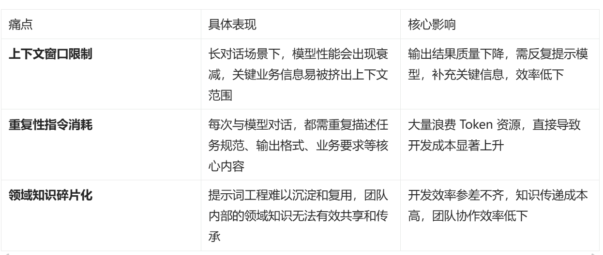

``` 
例:与大模型交互时,生成API文档,需要输入重复提示
1. 请使用markdown格式输出文档
2. 文档需包含的参数,响应示例,错误码
3. 需遵循什么规则等等 重复性的提示词

占用上下文,消耗token,上下文限制导致信息丢失,领域知识碎片化,无法复用
```
## skills(技能)
```
把知识,工具,流程封装为可复用,可执行的Skill(技能)单元,按需加载。
 正解决了上面的问题,其核心是让智能体能够按需加载流程化知识
(包含指令,领域知识,脚本和资源).以及企业,团队和用户专属的上下文信息,
通过智能体装备各类技能,根据当前任务动态扩展自身能力。
```

## 演进流程
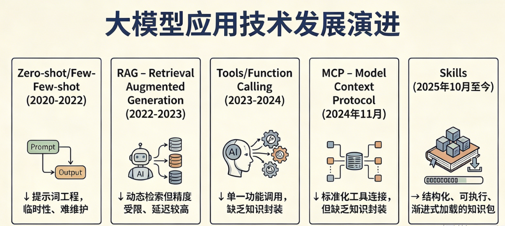

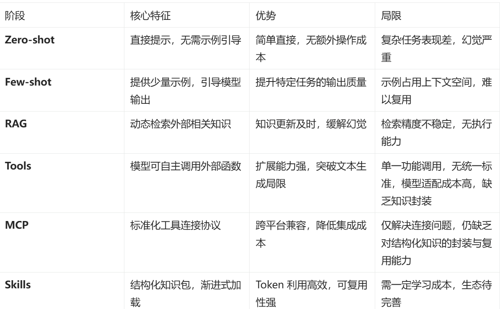

```
可以总结为:
1. Prompt是对模型的自然语言指令，负责告诉模型'要做什么(任务描述+输出格式+行为约束)',
是原始的意图表达
2.RAG是外部知识的动态注入机制,负责为模型提供'实时,准确,可溯源的外部信息',
解决模型知识过时和幻觉问题
3.TOOL是模型可调用的底层执行能力,是一段可执行的代码或接口,
相同输入永远给出确定输出
4.MCP是能力的标准化接入与发现协议,统一了模型与工具,数据源的链接方式,
让不同的LLM能便捷的发现,调度和调用TOOL
5.SKILLs则是在以上能力之上,将Prompt指令,RAG知识,Tool工具链,执行流程整体封装而成的结构化,
可复用,可编排的技能单元,供智能体按需加载,是面向复杂业务场景的最终可落地能力状态
```

## 什么是Skills
### 官方定义
``` 
Anthropic官方定义:Agent Skills是一种模块化能力单元，用于扩展智能体(如claude)的功能.
每个技能都会封装:执行指令,元数据,可选资源(脚本,模块,领域知识等),当场景匹配时，模型
会自动调用对应的技能来完成特定任务,让智能体更专业,更可控,更贴近实际业务需求
```
### Agent skills的定义
```
是一种轻量,开放的格式,用于通过专业知识与工作流扩展AI智能体的能力.
由指令,脚本和资源组成的文件夹,智能体可发现并使用它们,准确高效的完成任务.
```
### 结合定义
```
是一套可插拔，可复用,可组合的模块化专业能力封装.支持按需加载,自动触发。
类比为:给智能体准备的一套标准化岗位操作手册和工具包.就如为新团队成员
准备的入职指南
```
## 核心组成
```
Skill = Sikll.md(必须) + 资源文件(可选) + 可执行脚本
```
### 目录如下
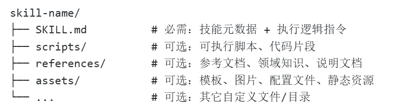

```
1.skill.md 是skill的核心入口和唯一入口必选文件,包含
元数据(YAML Frontmatter)：(必须有name,destribiton),
主指令(markdown)：描述技能用途,适用场景,执行步骤,版本,兼容等基础信息，语义匹配和识别

2.可执行脚本(Scripts)
用于封装复杂或重复性逻辑,实现自动化执行逻辑.通过外部执行降低模型推理负担,放在/scripts目录下
如validate.py：输入验证脚本  generate.py：代码文档生成脚本
deploy.py:部署,更新,环境初始化脚本,等等

3.资源文件(References & Assets)
提供领域知识,结构化模板,格式规范,素材和示例支持,支持按需加载,有效提升智能体执行准确性
和输出质量。常见资源资源文件如下:
```
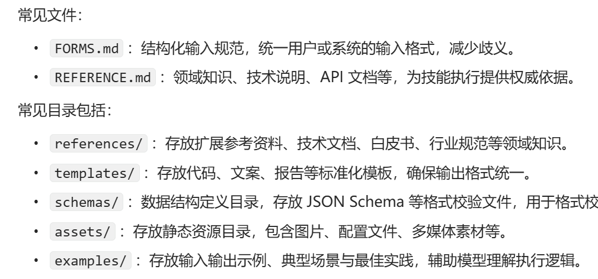

## 工作原理
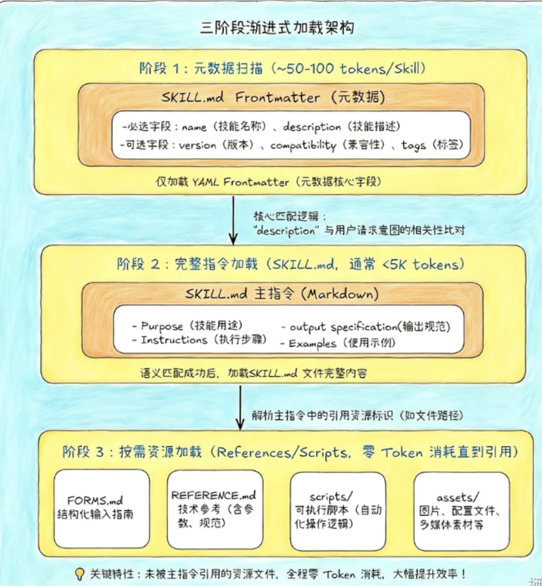

### 渐进式披露,按需加载 三个加载层级
```
L1:元数据层(Metadata,元数据):包含name和description两个核心字段,单skill元数据消耗100tokens。
判断是否需调用该skill，筛选的核心依据,可安装大量技能不占用上下文,知晓技能存在及使用该技能
L2:指令层(SKILL.md,主指令),skill.md完整主体文件,定义领域知识,工作流,最佳实践金额指引
L3:资源层(resources,辅助资源):可选的辅助支撑资源,如参考文档,可执行脚本,模板文件,素材等.
这类资源只有在主指令中引用时才读取并执行,未引用不占用token。随着技能复杂度提升,单一skill.md
可能无法容纳全部上下文,或部分内容仅在特定场景中适用.此时,技能可在目录中打包额外文件,并在
skill.md中引用.skill.md引用另外两个文件(reference.md和forms.md)。和核心skill.md一起打包.
```

## 设计思路
```
分层加载,按需调用。渐进式披露
1.发现.用name+description判断技能是否与任务相关,所需的最小信息,降低初始上下文
2.激活.当1的skill的description语义匹配度达到阈值时,agent触发该skill激活.加载完整的
skill.md中的主指令加载至LLM上下文.
3.执行.执行任务,根据需求,按需加载引用的资源文件或运行打包的可执行脚本,完成任务闭环
核心价值：保证Agent对用户执行请求的快速响应(初始加载少,Token消耗低).又能在在执行过程中
获取足够的上下文信息,.确报任务执行的准确性和完整性
```
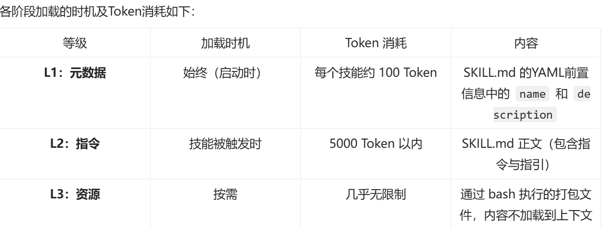

## 生命周期
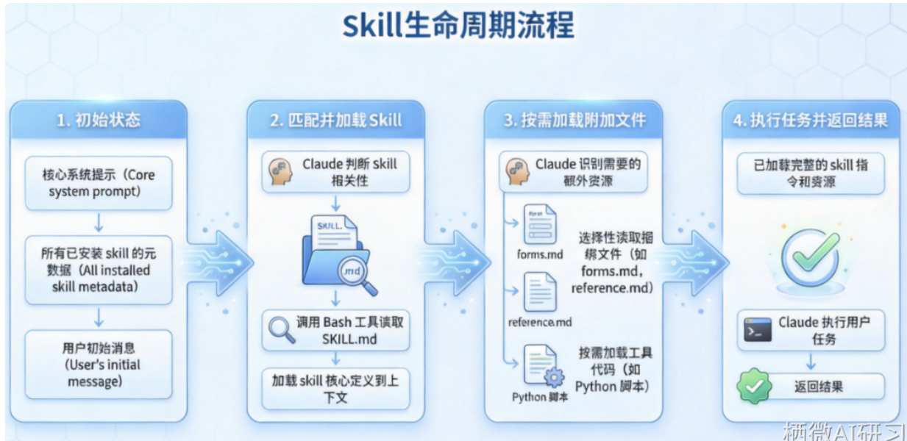

## 关键机制
```
1. 未引用文件零token消耗
2. 脚本执行不占用上下文
```

## 对比
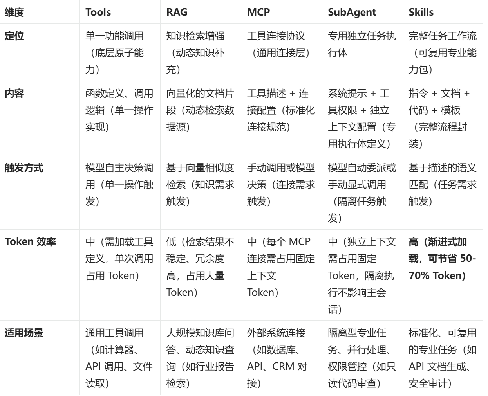

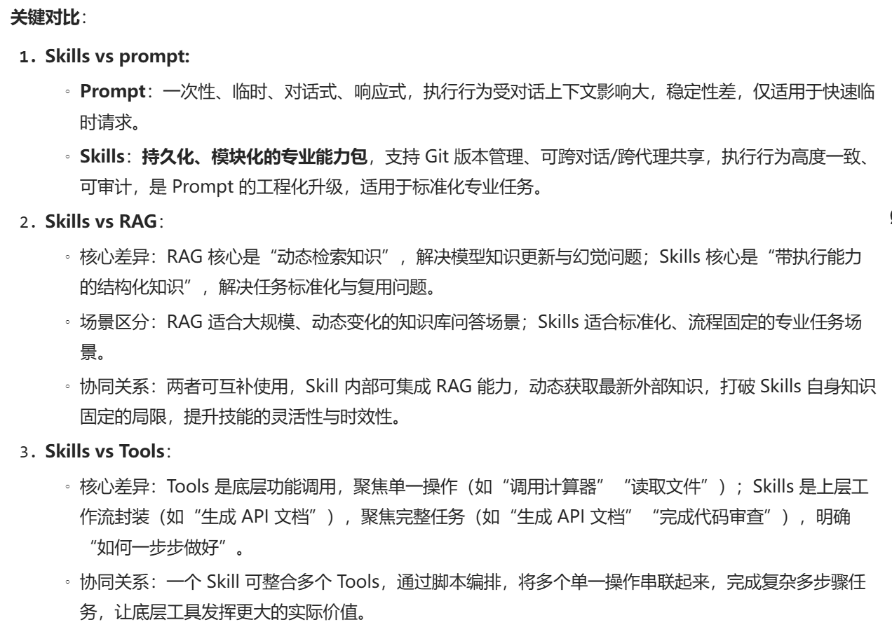

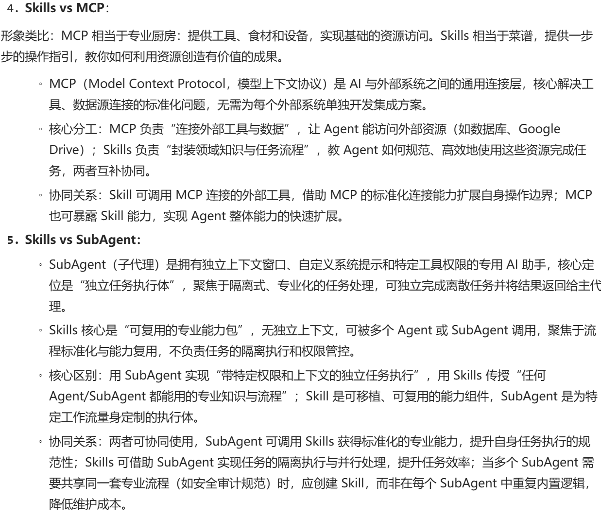

## 组合
```
复杂智能体最佳实践: MCP负责连接 + Skills负责流程 + subAgent负责任务隔离。组合架构,
搭配RAG补充动态知识,Tools提供底层操作,实现高效,稳定,可扩展的AI工作流
```
## 核心价值
```
解决了LLM'上下文窗口·限制·,重复性指令·消耗·,领域知识无有效·共享·'三大核心痛点
```

## 适用场景
```
具备结构化封装,可复用,可共享,支持渐进式加载与脚本编排特点，适用于
1.高频重复任务
2.标准化专业任务
3.团队协作任务
4.复杂多步骤任务
```
### 1.高频重复任务
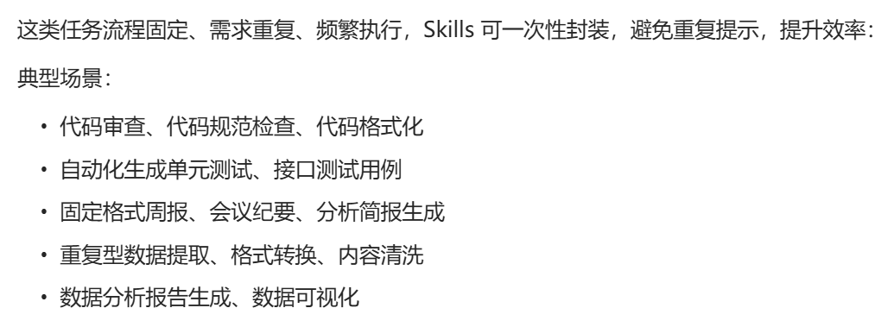

### 2.标准化专业任务
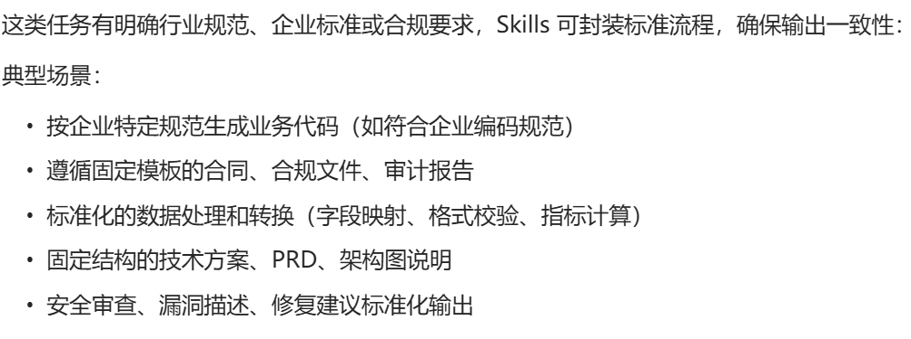

### 3.团队协作任务
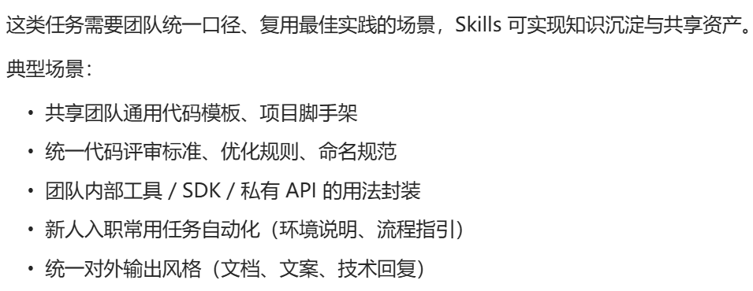

### 4.复杂多步骤任务
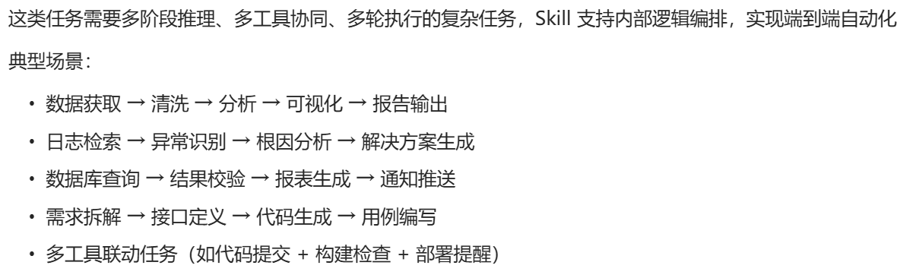